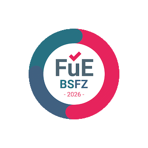
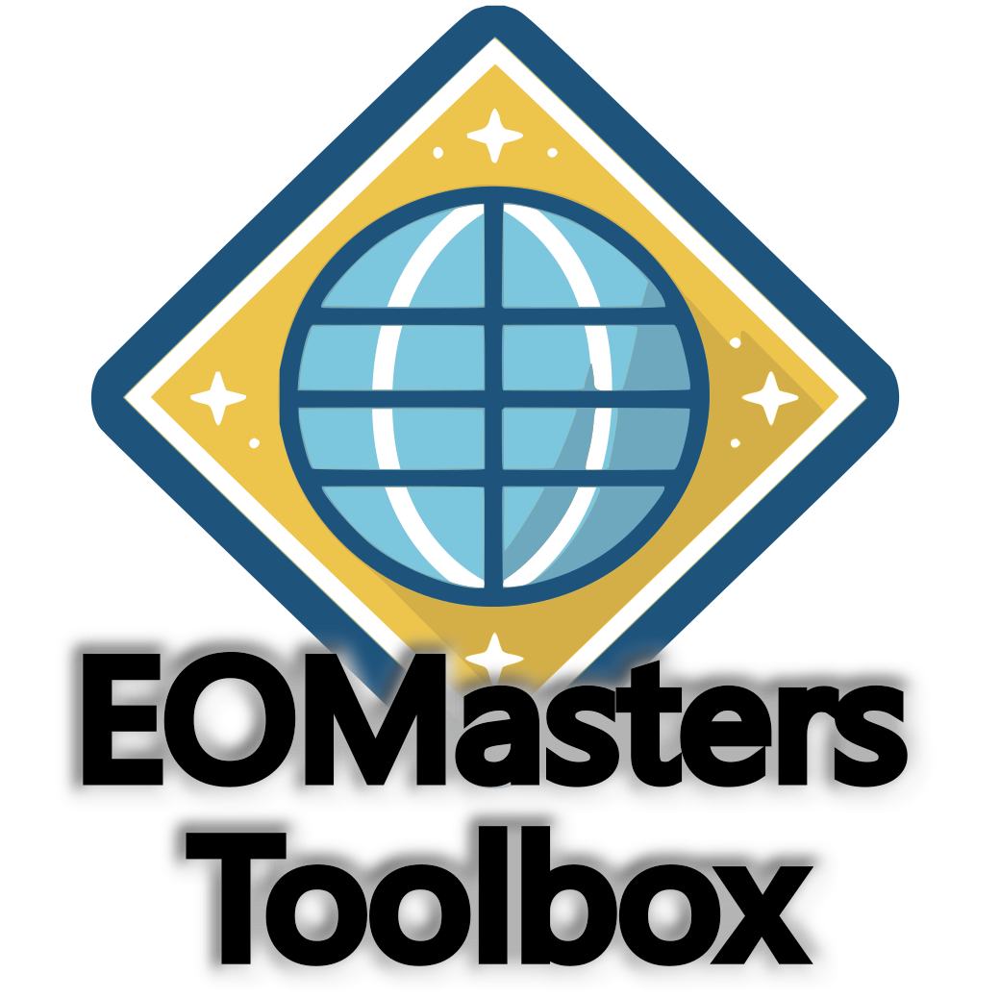

EOMasters Toolbox for SNAP
===============================

I'm proud to have been awarded a grant from the German “Bescheinigungsstelle Forschungszulage” — which roughly 
translates to “Research Grant Certification Office” or something along those lines. I am now allowed to wear this badge.
  

---
The EOMasters Toolbox (EOMTBX) is a collection of tools, processors, readers, and workflow enhancements that save time
while working with ESA's SNAP.

  

The toolbox comprises, for example, the following tools, features and options:

* Quick Menu 
  Provides quick access to the most often used menu actions.
* Loop GPT 
  Executes several GPT commands in one go.
* Band Maths Extensions 
  Adds new functionalities to Band Maths, like window calculations and checking if pixels are invalid.
* Wavelength Editor 
  Allows editing the wavelength properties of multiple bands and applying the changes to compatible products.
* Asset Library 
  Stores frequently used sites, geometries, masks, and other resources for quick access.
* SpeX - Spectral Index Database 
  Provides hundreds of spectral indices, executes them, and supports custom definitions.
* PyEditor and SnapKit 
  Edit and execute Python scripts directly in SNAP.
* Coastal Map and Cyanobacteria Index processors
* Sentinel-2 geometry up-scaling
* Sentinel-2 5 m super-resolution
* Sentinel-2 surface reflectance normalisation
* Sentinel-2 620 nm band estimation over water
* Sentinel-2 MSI L2A reader fixing issue of B1 detector footprint
* ASTER L1T and EMIT L1B/L2A readers
* Close Product Without a View 
  Simply closes all products that are not used by a Scene View.
* Generate System Report 
  Generates a system report usable for error reports to the developers.
* Options 
  Allow changing the settings of the tools and exporting them into a separate file, which can later be imported.

## Feedback

If you have suggestions for improvements and extensions, please use the
[issue tracker](https://github.com/eomasters-repos/eomtbx-issues/issues) or post on the [EOMasters Groups](https://www.eomasters.org/groups).

## Release Notes

The release notes can be found [here](https://github.com/eomasters-repos/eomtbx/releases).
